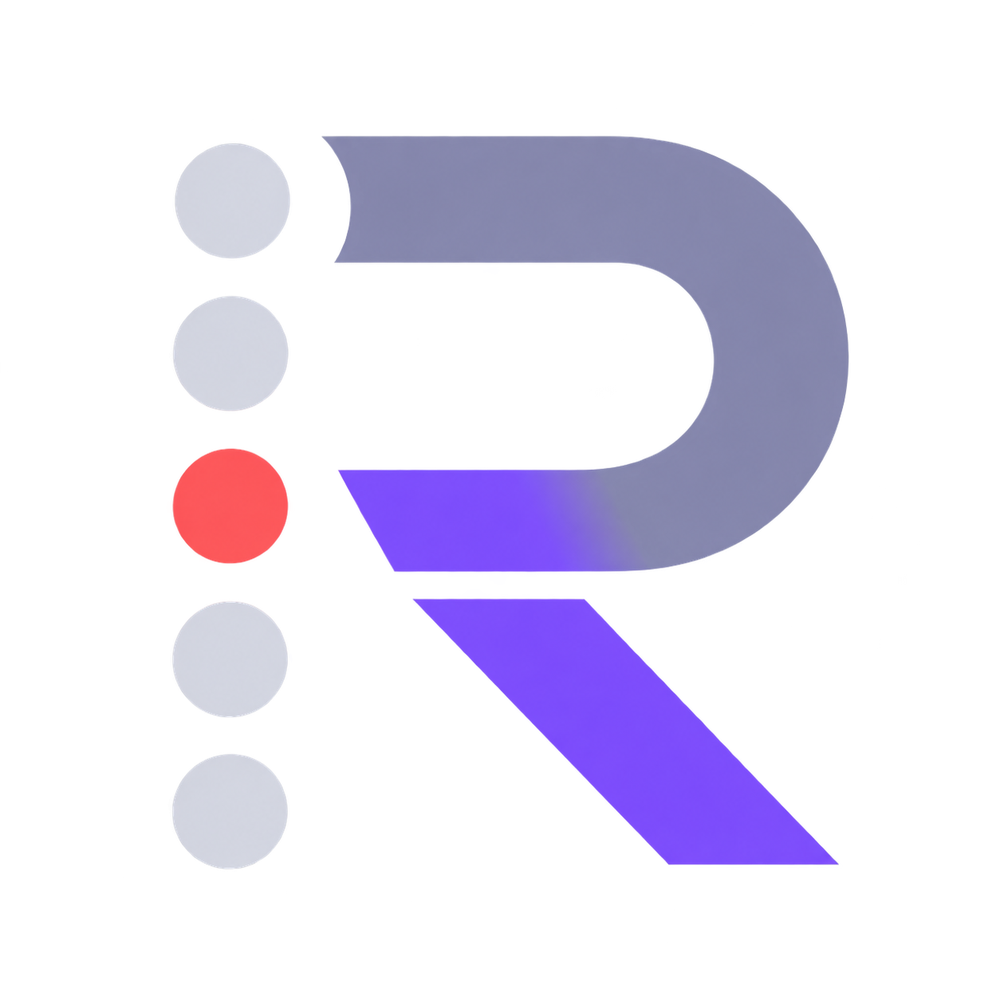
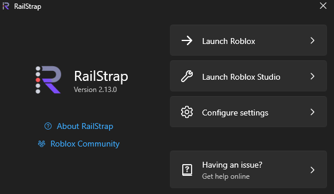
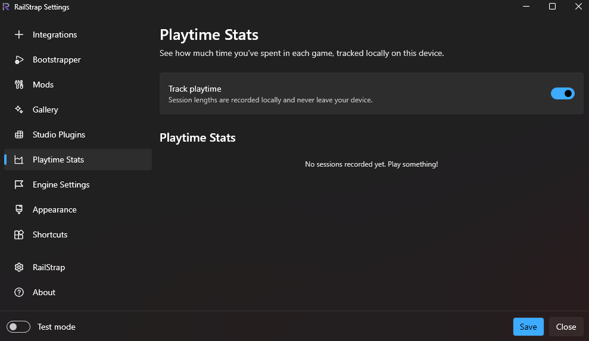
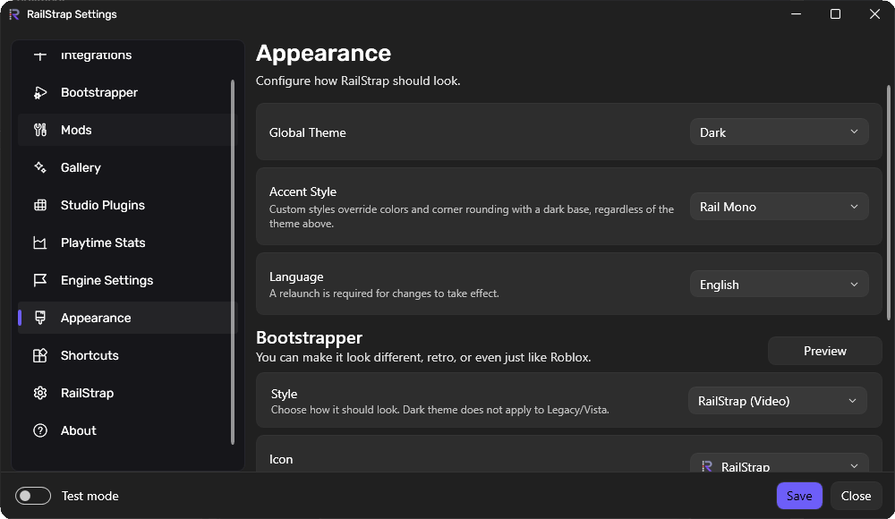

<div align="center">



# RailStrap

**A privacy-friendly, open-source Roblox bootstrapper for Windows.**

Launch Roblox, tune graphics, manage mods, track playtime, and control the experience from one app.

[Website](https://yoursel71.github.io/RailStrap/) · [Download](https://github.com/Yoursel71/RailStrap/releases/latest) · [Report an issue](https://github.com/Yoursel71/RailStrap/issues)

[](LICENSE)
[](https://github.com/Yoursel71/RailStrap/actions/workflows/ci-release.yml)
[](https://github.com/Yoursel71/RailStrap/releases/latest)
[](https://github.com/Yoursel71/RailStrap/releases)

</div>

> [!CAUTION]
> The only official RailStrap downloads are published in this GitHub repository. Other websites offering downloads or claiming to represent RailStrap are not official.

> [!NOTE]
> RailStrap is an independent personal fork of [Bloxstrap](https://github.com/bloxstraplabs/bloxstrap), originally created by pizzaboxer. It is not affiliated with Roblox Corporation or Bloxstrap Labs.

## What is RailStrap?

RailStrap replaces the standard Roblox launcher with a more capable Windows bootstrapper. It wraps the normal launch process and adds practical controls around it; it is not an exploit tool and does not inject into the Roblox client.

<p align="center">
  
</p>

## Highlights

- **Custom launch experience** — use a video loading screen while Roblox starts.
- **Selectable UI accent styles** — Rail Mono, Aurora Glass, and Rail Terminal each change accent colors, corner rounding, typography, and sidebar density, not just a palette swap.
- **Graphics controls** — configure FPS, MSAA, texture quality, and other FastFlag presets without editing configuration files manually.
- **Server tools** — view connection ping, see server location information, and quickly hop to another server.
- **Automatic recovery** — relaunch Roblox automatically after an unexpected crash.
- **Mods and themes** — manage content mods, cursors, sounds, and community bootstrapper themes.
- **Studio plugin manager** — browse, disable, and remove installed Roblox Studio plugins.
- **Discord Rich Presence** — show friends what you are playing, with optional server-join support.
- **Friend activity** — optionally view what friends are playing using credentials encrypted locally with Windows DPAPI.
- **Playtime statistics** — keep a private, per-game history of your play sessions on your device.
- **Logs and settings portability** — search Roblox logs and import or export RailStrap settings.

<p align="center">
  
</p>

<p align="center">
  
</p>

## Privacy

RailStrap is designed to keep your data on your computer:

- Telemetry is disabled by default.
- Settings, logs, and playtime records remain in your Windows user profile.
- Optional Roblox credentials are protected locally with Windows DPAPI.
- The source is public, so the behavior can be independently reviewed.

## Install

1. Download the installer from the [latest release](https://github.com/Yoursel71/RailStrap/releases/latest).
2. Run it and choose your preferences.
3. If prompted, install the [.NET 6 Desktop Runtime](https://aka.ms/dotnet-core-applaunch?missing_runtime=true&arch=x64&rid=win11-x64&apphost_version=6.0.36&gui=true).
4. Launch RailStrap from the Windows Start Menu.

RailStrap is currently unsigned. Windows SmartScreen may display a warning on first launch; choose **More info**, then **Run anyway** after confirming the installer came from the official releases page.

### Requirements

- Windows 10 or Windows 11, 64-bit
- [.NET 6 Desktop Runtime](https://dotnet.microsoft.com/en-us/download/dotnet/6.0)
- Roblox or Roblox Studio

## Build from source

The desktop app targets .NET 6 and uses WPF. The website uses Next.js, TypeScript, Tailwind CSS, and shadcn-style UI components.

### Desktop app

```powershell
git clone https://github.com/Yoursel71/RailStrap.git
cd RailStrap
dotnet build RailStrap.sln
```

### Website

```powershell
cd website
npm ci
npm run dev
```

The production website is deployed to GitHub Pages from `main` through GitHub Actions.

## Contributing and support

Found a bug or have an idea? Open a [bug report](https://github.com/Yoursel71/RailStrap/issues/new?template=bug_report.yaml) or [feature request](https://github.com/Yoursel71/RailStrap/issues/new?template=feature_request.yaml). Please include reproduction steps and relevant logs where possible.

## License and acknowledgements

RailStrap is available under the [MIT License](LICENSE). See [NOTICE.md](NOTICE.md) for attribution and third-party notices.

The desktop UI is built on a vendored copy of [WPF UI](https://github.com/lepoco/wpfui) (via [Bloxstrap Labs' fork](https://github.com/bloxstraplabs/wpfui)), customized for RailStrap's accent styles.
